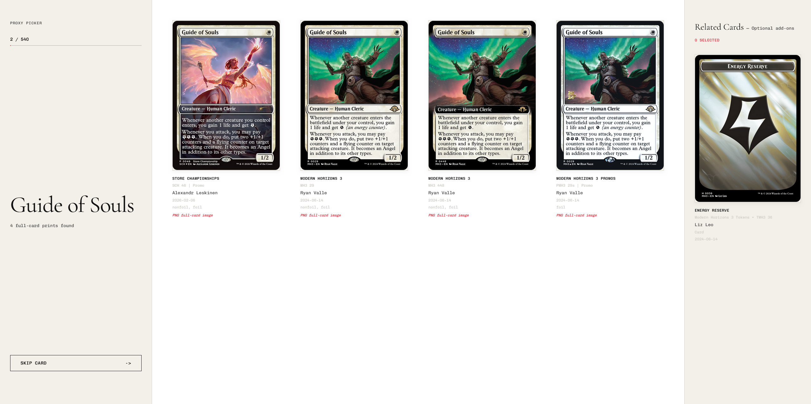

# Proxy Picker

Small local website for stepping through `MTGOVintageCube.txt`, choosing full-card Scryfall print images, optionally adding related cards from `all_parts`, saving the chosen images locally, and moving to the next card.



## Run

```bash
npm start
```

Then open `http://localhost:4310`.

## Output folders

- Default root: `./downloads`
- Single-image cards: `./downloads/single-faced`
- Cards whose selected match is treated as double-sided or whose name includes `//`: `./downloads/double-sided`
- Related add-ons from `all_parts`: `./downloads/related-cards`

## Card data source

- Source: the newest `default-cards-*.json` file in the project root
- If no such file exists, the server downloads the latest `default_cards` bulk file from Scryfall before startup continues

To use a different root folder, create it locally and start the app with:

```bash
PROXY_PICKER_OUTPUT_DIR="/path/to/your/folder" npm start
```

## Optional chaiNNer pipeline (`upscale.chn`)

This repo includes an example chaiNNer chain at `upscale.chn` for running `4x-UltraSharpV2` outside the app. Proxy Picker no longer ships its own built-in upscale or text-cleanup pipeline; chaiNNer is the supported path for that work.

Notes about the included chain:

- It was saved from chaiNNer `0.25.1`
- It references a `4x-UltraSharpV2` model input and writes PNG outputs
- The embedded paths are machine-specific Windows paths from the example environment, so you should update the model path and output path before using it on another machine
- It is intentionally separate from the local picker app itself

If you want to use chaiNNer directly, open `upscale.chn` in chaiNNer, point the model loader at your local `4x-UltraSharpV2` weights, and change the save/output nodes to your own directories.

### Optional border repair helper (`repair_reflected_bleed.py`)

For solid-border cards where reflected padding creates visible artifacts in the bleed area, the repo includes a standalone repair helper at `scripts/repair_reflected_bleed.py`.

What it does:

- Samples thin strips just inside the trimmed card edge
- Measures whether the sampled border colors are close enough to count as a uniform solid border
- If they are, repaints the outer bleed bands with the averaged border color
- If they are not, leaves the image unchanged unless you pass `--force`

This is meant for already padded card images, especially cases where reflection-based bleed looks wrong on flat-color borders.

Setup:

```bash
source .venv/bin/activate
pip install pillow numpy
```

Example usage on a directory:

```bash
python3 scripts/repair_reflected_bleed.py \
  ./reflected \
  ./repaired \
  --threshold 24 \
  --sample-depth 12 \
  --inset-along-edge 40
```

Useful flags:

- `--threshold`: max allowed pairwise RGB distance between sampled sides before the script decides the border is not uniform
- `--sample-depth`: thickness of the sampled strips just inside the trim edge
- `--inset-along-edge`: avoids sampling too close to the corners
- `--force`: always repaint the bleed bands even if the sampled sides differ
- `--dry-run`: print `REPAIR` / `LEAVE` decisions without writing files
- `--trim-width` / `--trim-height`: defaults are `2000x2800`

The script accepts either a single file or a directory tree and preserves relative paths when writing directory output.

## Suggested workflow

If you want a simple end-to-end proxy pipeline, the current repo tooling fits together like this:

1. Use `npm start` to pick your base card prints and any related add-ons into `downloads/`
2. Use `upscale.chn` in chaiNNer if you want an upscale pipeline based on `4x-UltraSharpV2`
3. Optionally run `scripts/repair_reflected_bleed.py` on padded outputs if reflection-based bleed looks wrong on solid-border cards

In practice, `repair_reflected_bleed.py` is most useful after you already have padded outputs, because it assumes the trim area is centered inside a larger bleed canvas.

## Progress

Selections and skips persist in `data/progress.json`, so restarting the server resumes where you left off.

Related-card selections also persist there, and the UI marks add-ons that were already selected from another card earlier in the run.

If you change `MTGOVintageCube.txt` or replace the Scryfall JSON dump, reset `data/progress.json` before continuing. The app warns when saved progress was created against different input files.
